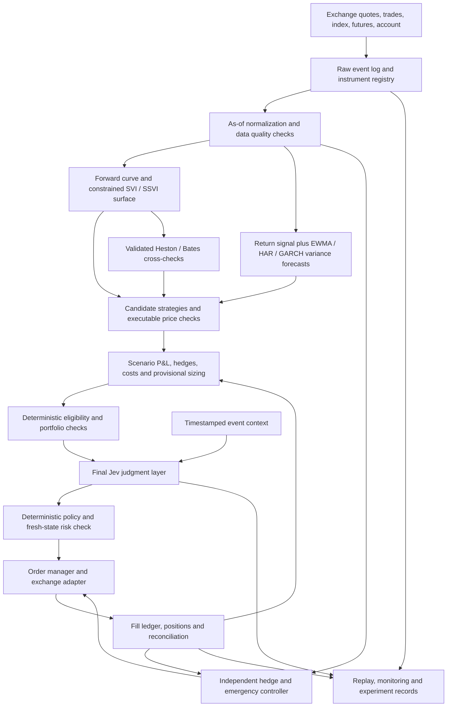

# BTC options trading architecture with a final Jev decision layer

**Superseded operating target:** paper first with BTC USDC linear options, 10,000 simulated USDC, uv and Bun. See [README](../README.md) and [implemented operations](OPERATIONS.md). Earlier small-live targets below are design history, not the current release policy.

Prepared 2 October 2026. This is an implementation plan, not a validated trading strategy. Model descriptions and exchange/API details were checked against primary sources; the proposed design, thresholds, schedule, and experiments below are engineering recommendations.

The user's mission, targets, and release gates are captured in [BTC_OPTIONS_GOALS.md](C:/Users/omern/Documents/Projects/btc-vol-models/docs/BTC_OPTIONS_GOALS.md). That brief governs the initial credit-spread scope and small-live delivery target.

## 1. Objective and initial scope

Build a reproducible quantitative BTC options system, establish its performance independently, then measure whether a final Jev layer improves trade selection. Success means reliable accounting and execution, controlled exposure, and evidence of an economic advantage after all costs. Good cross-sectional pricing fits alone do not satisfy that objective.

Confirmed brief: prioritize controlled returns and capital preservation using bull put and bear call credit spreads; use Black-Scholes, Heston, and Bates with a final Jev gate; target small live positions on Deribit. Consistency, win rate, and drawdown are validation objectives, not guaranteed outcomes. The following choices implement that brief:

- Venue: Deribit, matching this repository's existing data sources.
- Delivery target: a limited live system. Historical replay, shadow/paper operation, and exchange-integration checks are release prerequisites, not the final destination.
- Primary strategy: same-expiry bull put and bear call credit verticals, selected by net expected spread P&L, tail risk, liquidity, and market-state filters. A positive implied-versus-forecast variance gap is an eligibility input, not sufficient proof of spread edge.
- Initial instruments: sufficiently liquid BTC options roughly 7–60 calendar days from expiry; study 10–20 delta short strikes as the user's initial candidate band, with protection farther out of the money. Exact bands and widths come from liquidity and validated physical loss distributions.
- Decision horizon: intraday monitoring; initial forecast/holding horizons of approximately one day and one week, with explicit exit rules. Start with one selected horizon after validation. This is not a low-latency market-making project.
- Start with fully protected same-expiry credit verticals. Additional volatility structures and debit verticals are separate later experiments. Unprotected short-option exposure is outside the initial scope.
- The brief requests consistent inverse BTC handling. Implement and test inverse contracts, but settle the account numeraire and acceptable payoff bounds before selecting live products. Linear USDC verticals offer a straightforward width-minus-credit cap in their settlement currency. Inverse bull put verticals do not have a finite BTC-loss bound as settlement BTC/USD approaches zero; a strict BTC-denominated loss-cap requirement would exclude them or require a different structure/product.
- Do not systematically delta hedge the initial directional verticals. Their delta is part of the intended exposure; added hedge positions have their own risk budget and can break a simple spread-level loss bound.
- Capital, reporting currency, permissible losses, margin mode, and exact risk budgets remain configurable deployment inputs. No live sizing can be finalized without them.

Record these choices in a versioned strategy specification before evaluating performance. Changing a holding horizon, instrument filter, or entry rule creates a new experiment.

## 2. Proposed architecture



Jev is the final model layer for discretionary entry decisions. A deterministic authorization gate still follows it. Cancellation and emergency reductions use an independent control path, so an AI outage cannot prevent risk management. A hedge controller is available for explicitly enabled future strategies; initial directional spreads normally exit through their paired legs.

Each stage emits an immutable, versioned record. A candidate links back to its market snapshot, surface, forecast, portfolio state, cost assumptions, and strategy version. An order links back to its candidate and final authorization.

## 3. Model stack and responsibilities

| Responsibility | Initial model or method | Why include it | Promotion criterion |
|---|---|---|---|
| Quote conversion and IV/Greek benchmark | Forward-based Black pricing, with explicit discounting and settlement conventions | Simple, interpretable reference; one volatility per strike/expiry rather than one flat volatility for the whole chain | Matches independently checked quote conversions and finite differences |
| Current market surface | Constrained SVI/SSVI in total variance | Flexible representation of skew and term structure with enforceable static-arbitrage conditions | Stable fits inside uncertainty bands; dense-grid and extrapolation checks pass |
| Simple volatility forecast | Persistence and EWMA | Establish what extra model complexity actually buys | Retained as forecast and trading benchmarks |
| Physical return distribution | Historical residual scenarios conditioned on EWMA/HAR/GARCH; shrunk directional forecast only as challenger | Credit spreads need physical tail/strike-crossing probabilities and conditional losses | Reliable tail coverage and positive net spread utility relative to simpler/no-trade controls |
| Main realized-volatility forecast | HAR of log realized variance, with bias correction | Parsimonious use of short and longer variance histories | Improves horizon-matched out-of-sample forecast loss and/or trading utility |
| Alternative volatility forecast | GARCH(1,1) with Student-t innovations | Independent return-based forecast and heavy-tail distribution | Stable parameters and useful out-of-sample performance |
| Conditional asymmetry | GJR-GARCH or EGARCH challenger | Test whether asymmetry adds value for BTC | Beats the simpler GARCH under the same experiment protocol |
| Structural option model | Existing Heston, after validation | Stochastic-volatility cross-check and sensitivity study | Numerically reliable and useful for hedging/scenarios beyond surface interpolation |
| Jump-sensitive structural model | Existing Bates, after validation | Compare jump-sensitive valuations and stresses | Stable enough for its assigned role; cannot be promoted solely on fit RMSE |
| Statistical tail scenarios | Filtered historical simulation plus independent stress scenarios | Reduce dependence on any one parametric process | Portfolio replay and stress results are internally consistent |
| Final semantic judgment | Jev | Evaluate narrowly defined contextual questions | Incremental performance over deterministic contextual filters |

SSVI is a surface parameterization, not a physical return forecast. Gatheral and Jacquier derive static-arbitrage constraints for SVI surfaces; unconstrained per-expiry fits do not inherit those guarantees. [SVI/SSVI research](https://arxiv.org/abs/1204.0646)

HAR uses realized-volatility components across different time horizons. Adapting it to BTC's seven-day trading week is a design choice to test, not evidence that the original equity-market results transfer. [Corsi's HAR paper](https://papers.ssrn.com/sol3/papers.cfm?abstract_id=1365738)

Student-t innovations are available in established GARCH tooling, and analytical, simulation, and bootstrap forecasts have different horizon restrictions. Pin and test the selected implementation. [ARCH model documentation](https://arch.readthedocs.io/en/stable/univariate/univariate_volatility_modeling.html), [forecasting documentation](https://arch.readthedocs.io/en/latest/univariate/forecasting.html)

Heston provides stochastic volatility with spot/volatility correlation; Bates combines stochastic volatility and jumps. These are established formulations, rather than guarantees of BTC-specific robustness. [Heston paper](https://wwwf.imperial.ac.uk/~ajacquie/IC_Num_Methods/IC_Num_Methods_Docs/Literature/Heston.pdf), [Bates paper](https://www.nber.org/papers/w4596)

Defer rough Heston, local/stochastic-local volatility, Hawkes jumps, deep sequence models, and reinforcement-learning execution until the initial system demonstrates a limitation they could address. A supervised residual model can later challenge HAR/GARCH, using the same locked evaluation procedure. Ridge is a deliberately simple directional candidate, not a claim that BTC returns are reliably predictable.

## 4. Separate valuation from prediction

Maintain two explicit families of outputs:

1. **Risk-neutral / market-implied quantities:** fitted surface, market-consistent option prices, implied skew, and calibrated structural parameters.
2. **Physical / historical quantities:** future realized variance forecasts, historical return scenarios, and expected strategy P&L under a specified hedge/exit policy.

Parameters fitted to today's option chain cannot be treated as historical jump frequencies or physical return probabilities. A surface that reproduces today's prices has not predicted tomorrow's prices. Model residuals can indicate quote noise, omitted dynamics, or faulty conventions as well as trading opportunities.

For a delta-hedged option, the leading local contribution is schematically:

```text
hedged P&L ≈ 0.5 × option gamma × spot²
             × (realized variance increment − priced variance increment)
             + surface revaluation + jump/hedging residual
             − execution, financing and funding costs
```

This is intuition, not a complete discrete-time strategy valuation. Different strikes weight realized moves differently, and jumps, changing skew, discrete hedges, collateral, and costs matter. Do not turn ATM IV minus a generic RV forecast directly into an order.

For candidates, estimate a distribution of net P&L over the actual holding horizon. Simulate or replay spot returns, surface factor changes, basis/funding, hedge timing, and exits jointly. Use historical scenarios as the initial reference and validated structural simulations as challengers. Specify surface evolution explicitly: holding today's surface fixed is an assumption, not a forecast.

For the initial credit verticals, physical strike-crossing probabilities, conditional loss magnitudes, and path-dependent exits are central. Start with a zero-drift distribution and empirical conditional residual scenarios; test a simple trend filter and regularized return forecast only as challengers. Preserve dependence with surface changes. A positive ATM IV/RV gap can coexist with an unattractive vertical because the protective wing is expensive, tails are misestimated, or costs consume the credit. Emit no-trade when conservative net expectancy or tail coverage is inadequate.

Align implied and forecast integrated variance by horizon. If using ATM IV squared, call it an ATM variance-gap proxy. A genuine option-implied variance estimate uses a suitable option-strip methodology with finite-strike/liquidity caveats; DVOL can serve as a separate market-state indicator, not a substitute for the candidate's horizon/strike-specific economics.

## 5. Market data and instrument conventions

### Collection

Record options and hedge-instrument bid/ask prices, available depth, trades, index prices, expiry futures, funding, and account/order/fill updates. Use WebSocket streams for continuous collection and HTTP requests for instrument discovery, bootstrapping, and reconciliation. Deribit recommends WebSocket for real-time communication and provides separate test and production environments. [API introduction](https://docs.deribit.com/)

Use the venue's instrument metadata as the authority for expiry, tick size, multiplier, quantity units, minimum order size, settlement asset, and instrument lifecycle. The current repository's name parsing can remain an import helper but should not define production contract behavior.

Store both exchange event time and local receive time. Replays reveal only information received by the simulated decision timestamp. Track channel sequence/change identifiers where supported; gaps invalidate an affected book until a fresh snapshot restores it. [Market-data guidance](https://docs.deribit.com/articles/market-data-collection-best-practices)

### Normalized schema

```text
Instrument: id, family, expiry_utc, strike, option_type,
            contract_size, quantity_unit, price_unit, settlement_asset,
            tick_rules, minimum_size, metadata_version
Quote: instrument_id, exchange_time, receive_time, bid, ask,
       bid_size, ask_size, depth_ref, index_ref, forward_ref,
       quality_flags, sequence_ref, raw_event_ref
Snapshot: id, asof_receive_time, required_channels, freshness_status
```

Preserve native premiums and native balances. Derive reporting valuations separately. For an inverse BTC premium, current USD-equivalent value uses the contemporaneous BTC index conversion; the option's expiry forward is a distinct pricing input. Deribit describes inverse quotes in BTC and forward-based IV calculations. [Inverse contract specifications](https://support.deribit.com/hc/en-us/articles/31424939096093-Inverse-Options)

Linear options use USDC premiums and settlement. They have separate quantity and margin conventions. Choose the MVP family based on executable liquidity and account economics, not an assumed liquidity advantage. [Linear contract specifications](https://support.deribit.com/hc/en-us/articles/31424932728093-Linear-USDC-Options)

### Quality gates

Reject or quarantine crossed books, invalid units, missing required metadata, stale dependencies, incomplete depth, non-finite inputs, and expired instruments. Weight fresh but sparse quotes cautiously. A one-sided quote can provide an inequality constraint, but cannot be treated as a trustworthy midpoint. Retain both accepted and rejected records with reason codes.

Use a coherent as-of snapshot, not a mixture of option quotes and forwards collected at incompatible times. If timestamp skew is too large, do not generate a new trade. The tolerances depend on measured channel latency and instrument liquidity and are selected before final testing.

### History and storage

The supplied exports are isolated snapshots. They support numerical research, not credible trading or Jev performance claims. Begin raw collection immediately; inspect any historical source for executable quotes, timestamps, missing periods, delisted expiries, and settlement metadata. OHLC and exchange marks alone cannot establish option fill profitability.

Start with partitioned Parquet for immutable market events and DuckDB for research queries; use a transactional local ledger for orders, fills, and decisions. Lock dependency versions and keep data manifests/checksums. Introduce PostgreSQL or additional infrastructure when concurrent production processes require it, rather than making distributed services the first milestone.

## 6. Forward curve, surface, and calibration

For each expiry, determine an as-of forward from the corresponding liquid future, with bid/ask uncertainty. Check against put-call parity using synchronized liquid call/put pairs under the selected pricing convention. Use a documented interpolation or synthetic-forward fallback when necessary; mark its uncertainty and block trades when uncertainty consumes the alleged edge.

Replace the manual loader's 50-call-delta interpolation. Even for ordinary unadjusted Black forward delta, delta 0.5 implies d1 = 0, so K = F × exp(0.5 × sigma² × T); the corresponding strike is not generally the forward. Premium-adjusted delta adds further convention dependence.

Specify discount factors and collateral/funding conventions explicitly. BTC settlement does not itself justify a universal r = 0. Reproduce the exchange's IV display convention separately from the economic valuation model, and validate native-unit valuation/hedging for inverse contracts.

Represent log forward moneyness as k = log(K/F(T)) and total implied variance as w(k,T) = IV² × T. Fit OTM quotes after validity checks, with vega floors and quote-uncertainty weights. Carry native and normalized price/IV bid-ask bands through the fit.

Suggested calibration loss:

```text
sum_i quality_weight_i × robust_loss(
    distance(model_price_i, [bid_i, ask_i]) / quote_scale_i
) + temporal_stability_penalty
```

The distance is zero inside the executable interval; quote scale includes spread, tick, and numerical-error floors. Add a mild midpoint preference only if needed to resolve multiple valid fits. Tune temporal regularization on earlier data. Do not fit a smooth surface at the expense of masking a genuine regime change.

Enforce the chosen SSVI/SVI sufficient conditions in calibration and interpolation. Independently check option-price bounds, put-call parity, strike monotonicity, butterfly convexity, and calendar consistency in compatible forward/discount/settlement units. Inspect a dense grid, interpolation, and extrapolation. Exclude trades outside the validated domain. A finite grid is a diagnostic; it does not substitute for the parameterization's mathematical constraints.

Keep a model-health record: input coverage, residuals in spread units, boundary hits, parameter changes, convergence status, numerical error, arbitrage checks, and valid domain. A prior surface may remain useful for monitoring with inflated uncertainty, but stale surfaces cannot authorize new entries beyond their configured age.

For Heston/Bates, use warm starts, multiple starts when required, numerical convergence checks, and parameter-stability diagnostics. Keep risk-neutral calibration distinct from physical simulation fitting. Record Feller-condition status as a diagnostic; do not automatically reject every fit violating the sufficient positivity condition. Choose a suitable nonnegative variance simulation scheme for accepted parameters.

## 7. Physical return and volatility forecasting

For the initial credit spreads, establish a physical return distribution for the selected holding horizon and a simple, explicit bullish/bearish/neutral eligibility policy. Start with zero-drift and historical scenarios conditional on forecast variance. A ridge/regularized return specification with lagged momentum, realized variance, futures basis/funding, and liquidity features is a later challenger, compared with a simple trend rule. Normalize using training data only and heavily shrink unstable coefficients. This model is an experimental signal, not a guaranteed robust trading edge.

Construct a predictive return distribution using prior residuals scaled by the validated conditional variance forecast. Test historical joint scenarios as a challenger; preserve spot/volatility/basis dependence. If desired, add a regularized classification model for direction as a diagnostic, but a direction label alone cannot price spread expected P&L. Validate mean/quantile errors, interval coverage, and the actual capped-spread utility out of sample. Block trades whose economics depend on an uncertain directional estimate.

Compute realized variance from cleaned intraday log returns of a defined underlying series. Fix a UTC day boundary and annualization policy for the 24/7 BTC market; compare plausible sampling intervals to assess microstructure noise. Keep index-return RV and hedge-instrument-return RV distinct.

Forecast integrated variance over exactly the horizon the candidate will trade. Initial comparisons:

- Last observed variance and rolling historical variance.
- EWMA, with decay selected on training/validation data.
- Log-HAR using completed one-day, seven-day, and approximately thirty-day histories; test those calendar windows rather than importing five-/twenty-two-business-day conventions mechanically.
- GARCH(1,1)-t; GJR/EGARCH only as challengers.

If HAR predicts log variance, apply and validate a retransformation correction or predictive simulation; exponentiating a conditional log mean alone underestimates a conditional level mean. For longer-horizon GARCH, aggregate step variances consistently and use simulation where the model lacks an analytical forecast.

Use rolling or expanding fits with all feature availability times respected. Output the forecast mean, uncertainty intervals/scenarios, horizon, training cutoff, and health flags. Fit residual distributions using past data only. Estimate jumps historically only when sufficient sampling quality exists; do not reuse Bates' implied jump intensity as the realized estimate.

Compare QLIKE and forecast errors, interval coverage, and strategy-specific utility. Average competing forecasts in variance units, initially with equal weights. If learned weights help, constrain them and train only on prior validation folds. Correlated models do not create independent evidence or automatically reduce uncertainty.

## 8. Candidate generation and quantitative approval

Build a bounded strategy catalogue. Each template defines permissible legs, horizon, hedge instrument, entry conditions, exit conditions, and capital/risk treatment.

| Strategy | Primary hypothesis | Initial treatment |
|---|---|---|
| Bull put / bear call credit vertical, same expiry | Executable credit exceeds conservative expected payout and costs, with acceptable tails | First live candidate; native payoff bounds, both legs, and account-level risk must fit the budget |
| Bull call / bear put debit vertical, same expiry | Directional return and surface dynamics justify the executable net debit | Later directional branch |
| Purchased straddle/strangle with delta hedges | Future gamma-weighted movement/surface repricing compensates premium decay and costs | Later volatility branch; include hedge losses and funding |
| Capped-loss short-volatility structure | Collected premium exceeds modeled loss/cost with acceptable joint stress exposure | Separate experimental branch after multi-leg execution validation |
| Calendar spread | Relative term-structure movement creates an advantage | Later; short-front gamma, term dynamics, and expiry transitions require extra modeling |
| Skew/relative-value spread | Relative smile discrepancy persists beyond estimation and execution uncertainty | Later; use leave-out/lagged fits to avoid circular residuals |

A vertical spread is mainly directional; do not label every capped-loss spread a volatility trade. Calendar spreads and hedged structures do not inherit the simple maximum-loss formula of a same-expiry vertical. Native collateral and added futures hedges can also change total-account risk.

For a linear same-expiry credit vertical with both legs intact, maximum terminal option loss is strike width minus actual credit, multiplied by underlying quantity/multiplier, plus costs. During execution, the temporary long-only premium is a separate loss budget. Account drawdown also includes collateral conversion, liquidation/margin treatment, execution failures, and any additional positions.

For inverse spreads, derive bounds in the chosen currency instead of importing the linear formula. Let W be strike width, S_T the settlement BTC/USD price, c the initial BTC credit per underlying unit, and q the BTC-equivalent quantity. An inverse bull put spread has a BTC settlement debit W/S_T when BTC finishes below both strikes, so native net loss is q × (W/S_T − c), before fees. That BTC loss has no finite bound as S_T tends to zero. Its terminal USD settlement payout is bounded by qW, but initial credit converted at entry is not fixed terminal USD credit, and BTC collateral can decline simultaneously. This is a mathematical implication of the inverse payoff convention, not a prediction of a zero price. [Inverse payoff convention](https://support.deribit.com/hc/en-us/articles/31424939096093-Inverse-Options)

An inverse bear call spread has a different native bound: above both strikes its BTC debit is W/S_T, maximized at the upper strike boundary. Implement family- and structure-specific proofs/tests. If G1 requires a fixed BTC account-loss cap for every trade, reject inverse bull put spreads and use an eligible linear product or revise the permitted universe; a stop policy alone cannot prove the cap.

Do not optimize win rate in isolation. Illustratively, an 85% chance of winning 100 and a 15% chance of losing 900 gives expected P&L of −50 before costs. Estimate the full spread P&L distribution, not just the short strike's delta or probability of expiring OTM.

Initial spread execution policy: use an atomic/venue-supported combo when validated and feasible. Otherwise acquire the long option first, verify its fill, and sell no more short-leg quantity than the acquired protection covers. Close the short leg first if exiting sequentially. Account for the full temporary long-option premium when sizing: it can exceed the intended completed spread loss budget. If that temporary exposure does not fit the budget and a valid combo is unavailable, skip the candidate. Never place an unprotected short leg to rescue the expected spread economics.

For each candidate, produce the following before Jev runs:

1. Available entry and plausible exit prices at the requested size, including depth.
2. Distribution of gross and net P&L under the specified horizon, hedge, and exit policy.
3. Expected costs: all option legs, future/perpetual hedges, funding or basis carry, delivery where applicable, slippage, and adverse selection assumptions.
4. Portfolio Greek changes, scenario losses, margin estimates, and liquidity requirements.
5. Model disagreement and uncertainty from forecasts, surface, forwards, and cost/fill assumptions.
6. Provisional size from a deterministic budget; zero size when no admissible trade exists.

Rank candidates using a documented utility, for example expected net P&L minus a tail-risk penalty, subject to exposure, margin, and turnover constraints. Require a conservative net-edge margin that survives plausible cost and forecast perturbations. A simple heuristic can start research, but live sizing requires replay-calibrated estimates.

For relative-value signals, price the target using a fit that excludes its quote, or use an appropriate prior snapshot and out-of-sample estimate. Fitting a quote and then claiming the same fitted quote proves mispricing is circular.

Exits must be defined before backtesting: horizon expiry, signal reversal, target exposure, maximum holding period, adverse liquidity, risk-limit breach, and instrument expiry handling. Recalculate after actual fills and partial fills. Initial verticals keep their intended directional delta and favor paired exits. For later delta-hedged strategies, use a tested delta band and minimum interval, chosen against transaction costs.

## 9. Portfolio risk and account accounting

Implement the deterministic risk service before introducing Jev. Run checks before proposal generation, after Jev, after every fill, and continuously on the portfolio.

Track delta, gamma, theta, vega, vanna/volga where material, plus sensitivities to expiry-specific surface factors, skew, basis, funding, and collateral. Report both native asset equity and a consistent USD or USDC view. Benchmark strategy returns against holding the initial collateral and against a matched exposure/control portfolio, so BTC appreciation is not confused with strategy alpha.

Use market-surface Greek bumps for operational hedging and bucketed risk, alongside structural-model sensitivities. A bump to Heston/Bates v0 is not an equivalent parallel shift in all market IV quotes. Specify sticky-strike/sticky-moneyness assumptions and validate empirical hedge behavior. Use full repricing for large moves.

Stress spot moves in both directions, volatility level/skew/term shifts, funding spikes, BTC collateral drawdowns, stablecoin conversion changes where applicable, widening spreads, missing hedge liquidity, and venue outages. Include joint shocks and historical episodes, not just independent one-factor shocks. Stress grids such as 5%, 10%, 20%, and 30% spot moves are illustrative starting experiments, not adequate risk limits by themselves.

Support configurable per-trade loss budget, aggregate scenario loss, expiry concentration, delta/gamma/vega budgets, gross short-option limits, margin utilization, daily loss, drawdown, and minimum cash buffer. Reserve risk for open orders as well as filled positions. Check increments across the whole portfolio; individually acceptable trades can violate a joint limit.

Scenario expected shortfall describes modeled distributions; it is not a maximum possible loss. Enforce separate historical and hypothetical stress limits. Reconcile venue-reported initial/maintenance margin with the local engine, including the selected account mode. Pending orders and partial legs consume budget.

Jev cannot authorize a rejected candidate, increase an approved size, change limits, or delay compulsory risk controls. Failures block new discretionary entries while the independent controller continues validated hedging and exposure reduction when executable liquidity is available. A stop-loss order or policy does not guarantee its execution price.

## 10. Execution and settlement

Use a persistent order state machine:

```text
PROPOSED → AUTHORIZED → SUBMITTING → ACKNOWLEDGED
         → PARTIALLY_FILLED → FILLED / CANCELLED / REJECTED
         → RECONCILING when the outcome is uncertain
```

Use client order identifiers, persisted intent, bounded deadlines, and reconciliation before resubmitting after ambiguous timeouts. Do not assume network delivery is exactly once. Verify actual order attributes and post-only behavior on the selected venue interface. Recheck tick size, quantity, book freshness, edge, portfolio version, and margin just before submission. [Order-management guidance](https://docs.deribit.com/articles/order-management-best-practices)

Prefer an executable combo mechanism for multi-leg trades when supported and liquid enough. Otherwise specify leg order, maximum unhedged exposure/time, partial-fill response, cancellation, and unwind behavior. Buying protective legs first can reduce some risks but does not guarantee an economically acceptable fill. Simulate all partial-leg states before promotion.

Backtest conservative crossing at available bid/ask/depth first. Resting limit orders need a separately validated fill model accounting for queue position, cancellations, latency, and adverse selection. A quote touched during a bar does not prove a fill. Spread cost represented through entry/exit prices must not be subtracted twice.

Version the fee schedule and account tier by effective time rather than hard-coding a percentage of premium. Delivery and trading fees have product-specific rules and caps. [Current fee documentation](https://support.deribit.com/hc/en-us/articles/25944746248989-Fees)

Maintain an expiry event processor. Current Deribit documentation describes ITM options transitioning through corresponding futures before cash settlement; inverse options switched on 1 August 2026, and linear options use a similar process. Account for resulting records, existing futures netting, and delivery fees without double-counting P&L. [Inverse settlement](https://support.deribit.com/hc/en-us/articles/31424939096093-Inverse-Options), [linear settlement](https://support.deribit.com/hc/en-us/articles/31424932728093-Linear-USDC-Options)

Use UTC contract clocks and the documented delivery-price window; reconcile settlement against transaction records. Generic descriptions of cash settlement must not erase the current intermediate futures entries.

## 11. Jev overlay, added after the quantitative baseline

### Role and evidence boundary

Use Jev for bounded semantic judgments on already-approved candidates and timestamped event context. TypeSafe documents Choice, Score, and Noul primitives and recommends composing narrow questions in application code. [Introduction](https://docs.typesafe.ai/introduction)

The initial role is event relevance and contextual filtering: does a supplied, attributable report concern a venue outage, market disruption, or event that invalidates the assumptions of this particular strategy? A deterministic event calendar already handles known dates/windows. Jev adds interpretation only where the context is semantic.

If all inputs are numerical comparisons, implement that policy in code and benchmark a trained classifier; Jev may add little. TypeSafe's Jev 1.13 documentation identifies weaknesses in arithmetic, numeric precision, dates, distracting context, adversarial content, and structural consistency. These are integration constraints to test for the actual version used. [Known limitations](https://docs.typesafe.ai/model-jaggedness/jev-1.13)

### Inputs and outputs

Build a compact DecisionPacket containing candidate identity, strategy description, completed quantitative checks, named risk/uncertainty categories, and only relevant source excerpts. All arithmetic, comparisons, date-window checks, costs, and risk labels are computed in code. Include raw values in audit records; semantic buckets supplement rather than hide material detail.

Example internal packet, not the vendor's full request schema:

```json
{
  "candidate_id": "candidate-001",
  "snapshot_id": "snapshot-001",
  "portfolio_version": "portfolio-001",
  "strategy": "same_expiry_bear_call_credit_spread",
  "quantitative_status": "eligible",
  "edge_status": "survives_conservative_cost_assumptions",
  "physical_tail_and_market_state_status": "passes_validated_entry_policy",
  "completed_and_partial_fill_loss_status": "within_approved_budget",
  "model_agreement": "moderate",
  "liquidity_status": "adequate_at_approved_size",
  "time_policy_status": "outside_deterministic_event_blackout",
  "event_context": {
    "coverage": "available",
    "items": []
  },
  "allowed_actions": ["continue", "defer", "reject", "insufficient_context"]
}
```

Here, an empty item list is illustrative; production distinguishes a healthy feed with no relevant reports from missing coverage. A candidate with missing required context takes the predefined no-entry path.

Ask a few atomic questions: classify the supplied event as normal context, material disruption, or insufficient context; determine whether it contradicts the strategy's stated assumptions; identify which supplied event is relevant, with an explicit none/unknown option. Use descriptive Score levels only for qualitative severity, never as exact return or volatility regression.

The brief's public decision vocabulary is TRADE / SKIP / CLOSE. Map an eligible entry's CONTINUE to TRADE, and DEFER/REJECT/insufficient context to SKIP with explicit reason codes. Evaluate CLOSE only against an existing-position packet with permitted exit actions. A Jev CLOSE is advisory and passes deterministic protected-leg/risk/execution checks; required risk exits do not wait for Jev. The output confidence summarizes judgment concentration, not account safety or profitable-outcome probability. Derive explanation codes from the triggering rules and typed judgments, since Jev does not generate explanatory prose.

A deterministic mapper converts those judgments into CONTINUE, DEFER, or REJECT. DEFER expires the proposal and requires a new snapshot and candidate; it cannot hold an old price authorization indefinitely. In the MVP, Jev filters rather than increases positions or originates trades. Candidate ranking among approved strategies can be a later experiment.

### Probability handling

Keep answer probabilities and confidence as separate fields. TypeSafe defines Choice/Score confidence as concentration of the answer distribution; Noul has no separate confidence field. Neither proves trading profitability. Thresholds must be selected per question and validated on relevant labels. [Confidence documentation](https://docs.typesafe.ai/confidence)

Audit semantic classification using independently labeled historical/event examples, Brier or log loss where labels support them, reliability curves, false vetoes, and abstention coverage. Evaluate economic impact separately using strategy outcomes. Do not relabel a semantic probability as P(net P&L > 0), and do not transfer thresholds between Noul and Choice without testing.

### Adapter and failure policy

Implement a small provider adapter for TypeSafe's documented evaluation endpoint and typed responses. Keep credentials in runtime secrets. Validate response shape, candidate options, probability ranges, and distribution sums in code. [API reference](https://docs.typesafe.ai/api)

Persist provider/model version, question/criteria version, complete request/response, timing, token/cost usage, and state hash. Resolve mutable aliases to a pinned model when available; otherwise log the returned version and suspend promotion when it changes. API models and aliases are documented separately. [Model catalogue](https://docs.typesafe.ai/models)

Bound request size, latency, retries, and cache lifetime. A delayed answer is discarded if its snapshot, candidate, portfolio, or deadline is obsolete. No response, invalid response, contradictory required judgments, or uncertain evidence defaults to no new entry. Mandatory hedge/cancel routines remain independent.

Treat external news as untrusted data. Retrieve limited excerpts, preserve source and availability timestamps, distinguish event time from publication/receive time, remove duplicated reports, and test instruction-like text. Do not supply account keys or execution privileges to Jev. Its suggestions pass through the same deterministic risk gate as any other model output.

## 12. Proving whether Jev adds value

Use matched experimental arms with the same quantitative models, candidate generation, portfolio budgets, and execution simulation:

1. Quantitative baseline with no semantic context overlay.
2. Baseline plus deterministic event/calendar/context filters.
3. Baseline plus Jev context judgments and the same calendar policy.
4. Optional simpler classifier plus the same context, to test whether Jev's contribution needs this provider/model.

Run both candidate-level counterfactual analysis and independent full-portfolio replays. A veto changes future portfolio capacity, hedge trades, and opportunities, so subtracting the P&L of vetoed trades from one baseline ledger is not a sufficient comparison.

Collect labels and outcomes for every proposed candidate, including vetoes. Examine which events Jev identified, which profitable trades it blocked, which losses it avoided, and whether its benefits persist after matching risk/exposure. Lower drawdown achieved solely by holding more cash should be compared with a lower-exposure baseline.

A newly released model introduces a historical evaluation problem: today's model may know facts about older events that were unavailable at the historical timestamp. Strip identifiers where appropriate, use controlled semantic tasks for historical development, freeze versions, and rely on forward shadow/paper evaluation for credible incremental trading evidence. Replaying recorded API answers reproduces a past run; querying a mutable model anew does not.

Promote Jev only if its contribution survives time-separated data, matched exposure controls, conservative costs, reasonable threshold perturbations, and forward observations. Under this brief, the promotion objective is improved risk-adjusted trading results at matched exposure; semantic classification quality supports that evaluation but cannot replace it. A failed promotion removes Jev from the trading path while preserving the independently validated quantitative strategy.

## 13. Backtesting and validation protocol

Use event-driven replay rather than a vectorized close-price approximation. Replay instruments that existed at each timestamp, received quotes, fills, hedges, positions, margin, funding, and settlement. A fill can occur only after the modeled submission and acknowledgment latency.

Split chronologically into training, validation, and a final untouched period. Perform rolling walk-forward refits. Purge overlapping target/holding periods and use a horizon-appropriate gap around fold boundaries. Fit scaling, forecast ensembles, liquidity filters, trading thresholds, and Jev policies only on preceding training/validation data.

Seek at least a full year of usable option history, preferably more, plus underlying history across quiet, volatile, trending, crash, and dislocation periods. This is an aspiration subject to data availability. Validate coverage before choosing splits; limited history restricts claims. Bootstrap by time blocks rather than treating correlated intraday trades as independent.

Test pricing numerics, native payoff/accounting, as-of joins, model limiting cases, arbitrage constraints, Greek bump convergence, expiry clocks, partial fills, duplicate events, ambiguous timeouts, disconnect recovery, and margin breaches. Independent pricer comparisons are more valuable than tests that copy the same formula. Synthetic recovery tests must use several generators, not only Bates-generated data that favors Bates.

Report:

- Forecast QLIKE/errors and uncertainty coverage by horizon/regime.
- Surface errors in spread units, admissible-domain coverage, parameter stability, and fit failures.
- Net return in a chosen reporting numeraire, daily-return Sharpe with 24/7 annualization, uncertainty intervals, maximum drawdown, tail loss, turnover, and margin utilization.
- Hedging, options, collateral, carry/funding, fees, and slippage contributions.
- Liquidity/fill performance, rejects, partial fills, and executable capacity.
- Jev semantic calibration, abstentions, false vetoes, economic effect, cost, latency, and outages.

Use a chronological P&L ledger as the accounting authority. Greek attribution is explanatory and may leave a residual; it is not a replacement for exact cash-flow and mark reconciliation. Decompose native BTC strategy P&L and collateral translation without double-counting.

## 14. Repository-specific first changes

The inspected repository has vectorized Black-Scholes/Heston/Bates research pricers, calibration, finite-difference Greeks, live snapshot ingestion, manual exports, and plotting. The README reports synthetic and isolated real-snapshot studies. There is no demonstrated historical execution, forecasting, or portfolio engine yet.

| Existing component | Observed issue or gap | Planned change |
|---|---|---|
| `data.py: fetch_deribit_market` | Converts BTC premium using the underlying field and collapses underlying references to one median | Preserve actual index conversion, per-expiry forwards, native quotes, synchronized timestamps, and instrument metadata |
| `data.py: _estimate_forward` | Interpolates the strike at 0.5 call delta | Replace with future/parity-based forward construction; keep an explicit research fallback |
| `data.py` loaders | Mark-price snapshots and assumptions such as r = 0 | Add bid/ask/depth history, explicit quote/settlement/discount policies, and data manifests |
| `calibrate.py` | Relative squared price errors can overweight tiny premiums; basic optimizer results | Add uncertainty-aware robust losses, stability diagnostics, bounds/convergence records, and surface calibration |
| `models/heston.py`, `models/bates.py` | Fixed quadrature; README documents short-expiry wing failures; prices are clipped to nonnegative values | Return raw numerical diagnostics, validate intrinsic/time-value bounds, test accuracy against independent methods, and define safe domains |
| `greeks.py` | Structural vega bumps v0; finite one-day theta convention | Preserve labeled research sensitivities and add market-surface/bucketed Greeks and exact time policies |
| `analyze_manual_export.py` | Fixed snapshot-based studies | Retain as reproducible regression fixtures; add time-series research and event replay separately |

The plan does not claim the documented short-expiry failure's precise cause has been independently diagnosed. Validate integration/truncation/cancellation errors before selecting the repair. Zero clipping must not conceal invalid prices.

The synthetic study uses Bates as the data generator and a single flat Black-Scholes sigma as one comparator. That is useful for controlled recovery research, but cannot establish Bates as the best trading model or invalidate Black pricing with a full market surface.

## 15. Suggested implementation structure

```text
src/btc_options/
  domain/          typed instruments, quotes, units, candidates, decisions
  ingestion/       Deribit public/private feeds and metadata
  storage/         event log, data manifests, transactional ledger
  market/          quality checks, coherent snapshots, forwards
  surfaces/        constrained SVI/SSVI, interpolation, health
  pricing/         Black reference and validated structural adapters
  forecasts/       RV, persistence, EWMA, HAR, GARCH, ensembles
  scenarios/       historical paths, surface factors, jump/stress cases
  strategies/      templates, candidate generation, exits
  portfolio/       positions, cash, margin, collateral and P&L
  risk/            sizing, Greek budgets, stress limits, emergency policy
  decision/        Jev adapter, atomic questions, policy mapper, records
  execution/       order state machine, reconciliation, hedge controller
  backtest/        replay, latency/fills, settlement, counterfactuals
  monitoring/      health, drift, exposures, experiment reports
configs/            research/paper/live policies and versioned assumptions
tests/              meaningful numerical, accounting and recovery checks
docs/               design records and experiment specifications
```

Begin as a modular Python application with immutable boundaries, not many microservices. Run data capture independently so calibration or an API request cannot stall it. Separate execution/risk monitoring from research work; share versioned state through the ledger and defined messages. Add asynchronous networking only where needed.

Suggested dependencies: existing NumPy/SciPy/pandas; Parquet/DuckDB tooling; validated GARCH library; schema validation; a tested WebSocket/HTTP client; pytest for the consequential numerical/accounting/execution tests; TypeSafe SDK only when the Jev phase begins. Audit current versions and licenses during implementation, then lock the environment.

Runtime modes: RESEARCH has no exchange order access; SHADOW logs decisions against live data; PAPER simulates orders against production market data; TESTNET verifies exchange integration; LIVE requires separately configured account policy and operational readiness. Testnet verifies mechanics, not realistic production liquidity or profitability.

## 16. Milestones and acceptance gates

Durations are rough engineering estimates for one focused developer with domain support. Data acquisition, sparse strategy opportunities, and regime coverage can extend elapsed time. Start data collection alongside the first milestone.

| Phase | Approximate effort | Deliverable | Required acceptance evidence |
|---|---|---|---|
| 0. Specification and audit | 3–5 days | Settlement family, numeraire, strategy/hedge policy, input inventory, reproducible current studies | Every amount/time/Greek has documented units and conventions; data gaps identified |
| 1. Data and accounting foundation | 1–2 weeks | Capture/replay, registry, native ledger, forward construction | As-of joins and expiry/payoff cases reconcile; book gaps are detected and recovered |
| 2. Pricing and surface | 1–2 weeks | Black reference, constrained surface, pricer health and Greeks | Independent numerical comparisons; arbitrage/domain checks; errors below the strategy's usable edge tolerance |
| 3. Forecasting | 1–2 weeks | Physical return scenarios, RV dataset, EWMA/HAR/GARCH, horizon-matched tail forecasts | Walk-forward tail/variance report and spread utility; no feature/label leakage |
| 4. Quantitative strategy and risk | 1–2 weeks | Credit verticals, currency-specific capped-loss sizing, exits, stress/margin engine | Cost-aware full-portfolio replay; protected-leg execution and emergency-policy tests pass |
| 5. Paper/testnet execution | 1–2 weeks to engineer | Persistent order manager, reconciliation, monitoring | Restart/timeout/disconnect drills; ledgers reconcile; paper fills calibrated conservatively |
| 6. Jev shadow overlay | About 1 week to engineer | Versioned packets, atomic semantic judgments, matched experiment arms | Schema/failure tests and semantic labels; quantitative baseline remains independently measurable |
| 7. Forward paper evaluation | 4–8 weeks initially, extended as evidence requires | Production-quote baseline/filter/Jev comparison with matched risk | Sufficient independent opportunities and event variety; stable cost, risk and operational results |
| 8. Limited live rollout | Delivery target after release gates | Small credit spreads, staffed monitoring, recovery playbooks | Configured capital/risk limits, measured execution economics, account readiness and tested kill switch |

Expect roughly 8–12 engineering weeks for a credible initial platform, with some overlap between phases. This is not a promise of a profitable model, and forward validation may take substantially longer.

Define numerical tolerances relative to spreads/ticks and candidate edge, rather than one universal price error. Define performance gates before looking at the final test set. All promotion decisions require uncertainty assessment; no arbitrary Sharpe or trade-count cutoff substitutes for independent evidence.

Freeze the user's proposed acceptance targets before final testing: choose one exact per-trade ceiling within 1–2% of strategy equity, one exact drawdown halt within the proposed 10–15% range, and a profit-factor target above 1.3 after costs. Start live below the ceiling if practical. Win rate in the proposed 75–85% band remains a diagnostic with uncertainty rather than a delta-derived guarantee. Aggregate stress/collateral budgets, daily halts, and margin buffers must support those targets. Drawdown triggers cannot guarantee the realized maximum in a discontinuous market.

### Small-live launch policy

- Use a dedicated subaccount and the smallest admissible spread quantity that fits the configured loss budget, after proving the selected structure's cap in the selected currency. If exchange minimums, fees, or temporary long-leg premiums are too large, the system must stay at no-trade rather than resize above the budget.
- Start with one strategy, one holding-horizon policy, one settlement family, and at most one open spread. Restrict the expiry/strike universe to the validated liquidity domain.
- Define loss budgets in the chosen account currency before deployment. Illustrative starting research settings might be a 0.25% equity completed-spread loss budget, 1% aggregate scenario-loss budget, and a 1% daily strategy-loss halt. These are proposed settings to test and configure, not universally appropriate risk recommendations. Initial live sizing can be stricter.
- Budget the largest partial-fill state separately from the completed spread. For example, a hypothetical linear spread with 2,000 USDC width, 300 USDC credit, and 0.01 BTC-equivalent size has 17 USDC terminal option loss before costs. A 2,500 USDC long-leg premium temporarily costs 25 USDC. Size against at least the 25 USDC exposure if legging, as well as actual margin and the completed structure. These amounts are illustrative and not current quotes or a minimum-size claim.
- Start with paired limit execution, explicit timeouts, active reconciliation, and a deterministic exit/expiry policy. Use API permissions limited to the dedicated strategy's trading needs, with withdrawals disabled.
- Compare actual fills, net credit, fees, margin, and P&L against paper expectations after each trade. Suspend new entries on unexplained ledger drift, liquidity deterioration, adverse execution errors, or risk breaches; preserve protected positions while reconciling.
- Increase one dimension at a time only after predefined operational and economic evidence: quantity, simultaneous spreads, broader expiries, then new strategies. Do not scale merely because the first few trades profit.
- Keep Jev in shadow first, then enable its filter at the already-approved size after semantic and forward-performance validation. Under the user's brief, if Jev fails its incremental-value gate, remove it from the trading decision path; the independently validated rules-only system can still be released.

## 17. Concrete first sprint

1. Freeze the current study outputs and record environment/data versions.
2. Write a contract/convention specification for the chosen BTC option family, bull put/bear call credit verticals, and reporting currency.
3. Define typed instrument, quote, snapshot, forward, and native ledger records.
4. Implement public raw-event capture and quote quality diagnostics; obtain sample production books without submitting orders.
5. Replace index/forward conflation and the 50-delta forward proxy in a separately tested market adapter.
6. Add independently verified Black pricing/IV/unit/payoff fixtures and Heston/Bates numerical-domain checks.
7. Build a constrained surface and initial physical-tail/RV/EWMA reports against simple benchmarks.
8. Produce candidate records with gross edge, all costs, uncertainty, and scenario exposure; stop before execution until replay accounting works.

The first sprint's reviewable result is a coherent market snapshot, validated valuation/forecast outputs, and a fully explained candidate or no-trade decision. Jev integration starts after the quantitative baseline, risk engine, and replay can measure its marginal effect.
